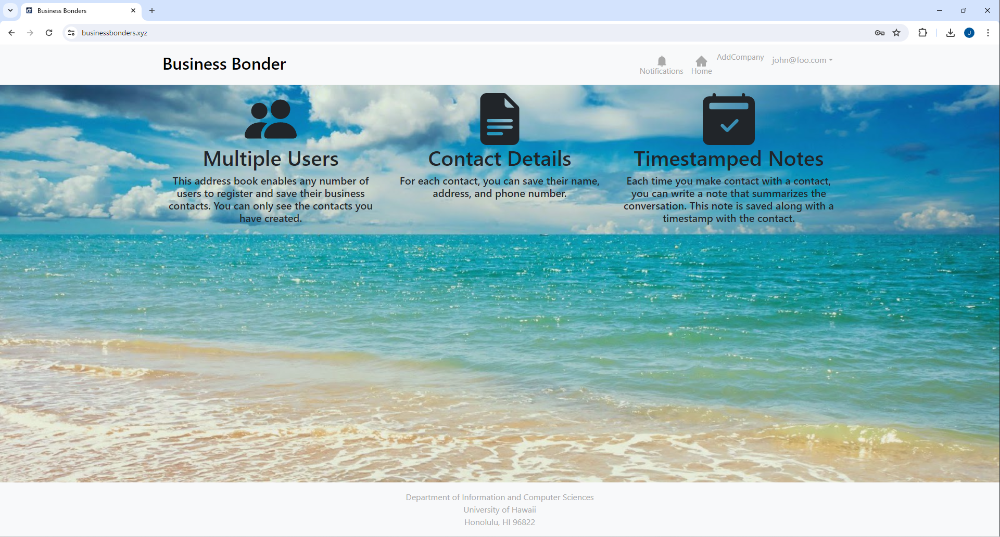

  

 

## Table of contents

* [Overview](#overview)
* [Project Goal](#project-goals)
* [User Guide](#user-guide)
* [Team](#team)
* [Links](#links)

## Overview
The problem: Many UH computer science and engineering students want to learn about internship and job opportunities, but currently they must wait until a company decides to visit the campus or send out some sort of announcement. There is no efficient way for students to understand the “landscape” of internship and job opportunities that might be available in the future, so they can prepare for them now.

The solution: The Company Connector web application provides a new way for local and non-local companies who want to recruit students from UH to make their (potential) opportunities known to students. At the same time, students can create profiles on the site with their interests. The site can match students to employers and vice-versa.

## Project Goal
This project, upon completion, will offer students of the University of Hawaii at Manoa a platform for accessing internship and job opportunities from local and non-local companies. The platform would connect students with companies seeking to recruit talent from the University of Manoa, offering detailed company profiles, customized matching, and a user-friendly interface.

## User Guide
This section offers a preview of the Business Bonder interface and its functionalities. While the project is in its planning phase, this section showcases mockup pages intended for integration into the final application.

### Landing Page

### Login and Sign Up Page

### Admin Page 

## Team
Business Bonder is designed, implemented, and maintained by:
* [James Ivan Cartagena](https://jicaartagena.github.)
* [Colby Fuke]()
* [Brandon Nakata]()
* [CJ Charles James Caraang]()

## Links
See our [Team Contract](https://docs.google.com/document/d/1wR9g73pu1SJRpXFbqFpmOFahrW98Q21cmLE8qssi0cE/edit?usp=shar) here!

Visit our [GitHub Organization](https://github.com/Business-Bonder) here!

Look at our goals for [Milestone 1](https://github.com/orgs/Business-Bonder/projects/1/views/3) at this project page!

Look at our goals for [Milestone 2]() at this project page!
